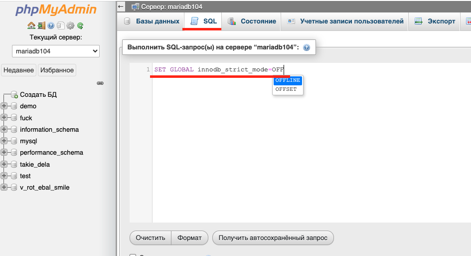

# mariadb_tarball_install_guide


## Если ты ROOT.
```sh
# Делаем группу и добавляем туда пользователя
groupadd mysql
useradd -g mysql mysql
# не нуждается в комментариях
cd /usr/local
# Скачиваем Tarball с оф. сайта
wget https://mirror.truenetwork.ru/mariadb/mariadb-10.4.32/bintar-linux-systemd-x86_64/mariadb-10.4.32-linux-systemd-x86_64.tar.gz
# Распаковка таксиста чек.
tar -zxvpf mariadb-10.4.32-linux-systemd-x86_64.tar.gz
# Создаем symlink
ln -s mariadb-10.4.32-linux-systemd-x86_64 mysql
cd mysql
# У Tarball уже есть какие-то скрипты, которые мы и будем юзать
./scripts/mariadb-install-db --user=mysql

# Даем права
chown -R root .
chown -R mysql data

# Ну и так как у нас не mysql от Ubuntu, а Mysql из скачанного Tarball, то добавляем его в окружение.
export PATH=$PATH:/usr/local/mysql/bin/
```
Далее, нужно поработать с автозапуском.
```sh
cp support-files/mysql.server /etc/init.d/mysql.server
cp support-files/systemd/mariadb.service /usr/lib/systemd/system/mariadb.service
mkdir /etc/systemd/system/mariadb.service.d/
```

```sh
cat > /etc/systemd/system/mariadb.service.d/datadir.conf <<EOF
[Service]
ReadWritePaths=/usr/local/mysql/data
EOF
```

```sh
systemctl daemon-reload
# Запуск службы
systemctl start mariadb.service
# Добавляем в автозапуск, если все ок.
systemctl enable mariadb.service

```


В целом, это все. Проверять работу mariadb можно с помощью команды 
```sh
systemctl status mariadb.service
```
там будет active(running)


## Создание рут-пользователя

```sh
mariadb

Mariadb[None]: CREATE USER 'admin_user'@'localhost' IDENTIFIED BY 'password';
...

Mariadb[None]: GRANT ALL PRIVILEGES ON *.* TO 'admin_user'@localhost IDENTIFIED BY 'password';
...

Mariadb[None]: FLUSH PRIVILEGES;
...
```


Если возникает проблема, а-ля
```
type: rpc, query: cannot connect to server
```
, то в ISPManager -> Настройки -> Настройки Web-сервера -> Включить работу с внешними приложениями через SSL


# Остальное:

### innodb_strict_mode
